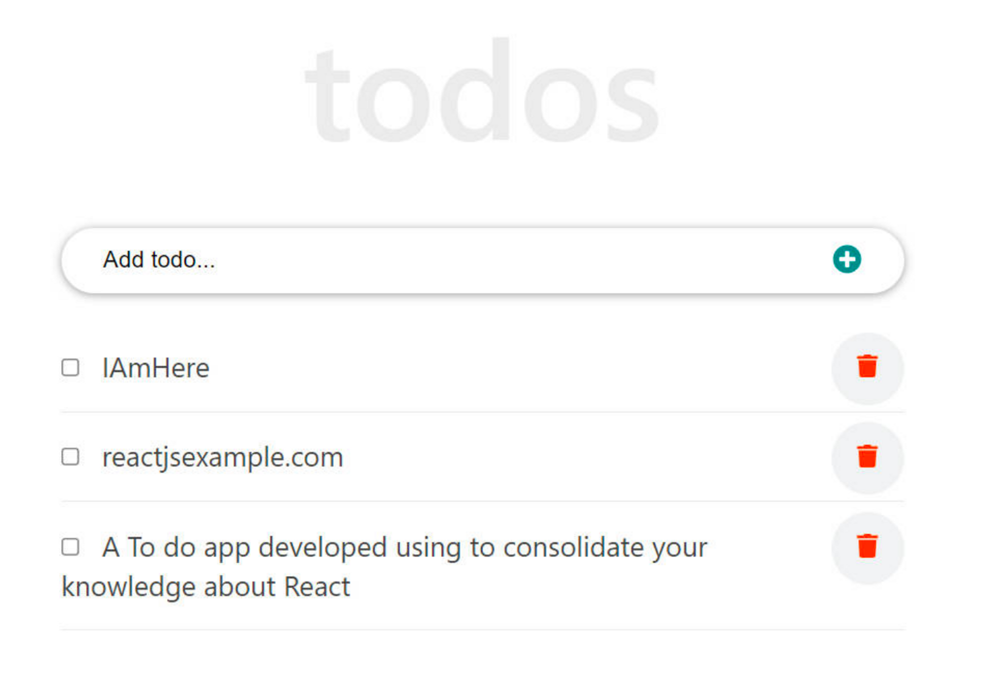

# Getting Started with Create React App

This project was built as part of series of React exercises given by [The Gym](https://www.thegym-rwanda.com/). 
## Instructions

Build a react to-do app that performs basic tasks such as adding a to-do, marking it as completed, and deleting it.

To make the design, you can use tailwindcss and fontawesome for the icons.

A checkbox on the to-do list marks the task as completed. Keep in mind that a completed task should be displayed with the name struck through

eg: ~~IAMHere~~

## Technologies
* ReactJS
* TailwindCSS
* Font Awesome

## Run Project Locally
First, ensure you have node (node v16+ and npm installed)

* `git clone https://github.com/alain-kubwayo/todo-app-reactjs.git`
* `cd todo-app-reactjs`
* `npm install`
* `npm run start`

The last command spins up the local development server on port 3000 by default.

## Screenshot(s)

